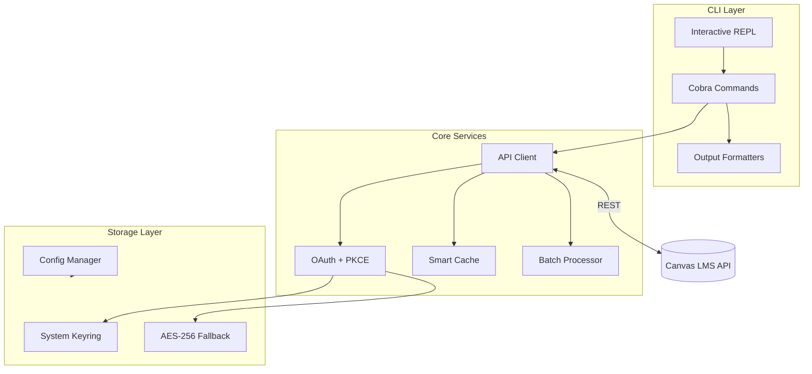

# Canvas CLI

[](https://go.dev/)
[](LICENSE)
[](https://goreportcard.com/report/github.com/jjuanrivvera/canvas-cli)
[](COVERAGE_REPORT.md)

A powerful command-line interface for [Canvas LMS](https://www.instructure.com/canvas), built with Go.

## Features

- **Secure Authentication** - OAuth 2.0 with PKCE, system keyring integration
- **Multi-Instance** - Manage multiple Canvas instances from one CLI
- **Smart Rate Limiting** - Adaptive throttling based on API quotas
- **Multiple Outputs** - Table, JSON, YAML, and CSV formats
- **Interactive Mode** - REPL shell with command history and completion

## Architecture



## Quick Start

```bash
# Install
go install github.com/jjuanrivvera/canvas-cli/cmd/canvas@latest

# Authenticate
canvas auth login https://your-school.instructure.com

# Start using
canvas courses list
canvas assignments list 12345
canvas shell  # Interactive mode
```

## Command Overview

| Category | Commands |
|----------|----------|
| **Auth** | `login`, `logout`, `status` |
| **Courses** | `list`, `get`, `users` |
| **Assignments** | `list`, `get`, `create`, `update`, `bulk-update` |
| **Submissions** | `list`, `get`, `grade`, `bulk-grade` |
| **Users** | `me`, `list`, `get`, `create`, `update` |
| **Modules** | `list`, `get`, `create`, `update`, `delete`, `items` |
| **Pages** | `list`, `get`, `create`, `update`, `delete`, `front` |
| **Discussions** | `list`, `get`, `create`, `entries`, `post`, `reply` |
| **Announcements** | `list`, `get`, `create`, `update`, `delete` |
| **Calendar** | `list`, `get`, `create`, `update`, `delete` |
| **Planner** | `items`, `notes`, `complete`, `dismiss` |
| **Files** | `upload`, `download` |
| **Utilities** | `shell`, `doctor`, `webhook`, `version` |

## Documentation

| Guide | Description |
|-------|-------------|
| [Installation](docs/INSTALLATION.md) | Build from source, platform-specific setup |
| [Authentication](docs/AUTHENTICATION.md) | OAuth setup, multi-instance, security |
| [Commands](docs/COMMANDS.md) | Complete reference with all flags |
| [Examples](docs/EXAMPLES.md) | Workflows, automation, scripting |
| [Architecture](docs/ARCHITECTURE.md) | Design decisions, internals |

## Configuration

```yaml
# ~/.canvas-cli/config.yaml
default_instance: myschool
instances:
  myschool:
    url: https://myschool.instructure.com
    client_id: your-client-id
settings:
  default_output_format: table
  cache_enabled: true
```

See [Authentication Guide](docs/AUTHENTICATION.md) for detailed setup.

## Contributing

We welcome contributions! See [CONTRIBUTING.md](CONTRIBUTING.md) for guidelines.

## License

[MIT License](LICENSE)

---

Built for the Canvas LMS community. Based on the [Canvas REST API](https://canvas.instructure.com/doc/api/).
