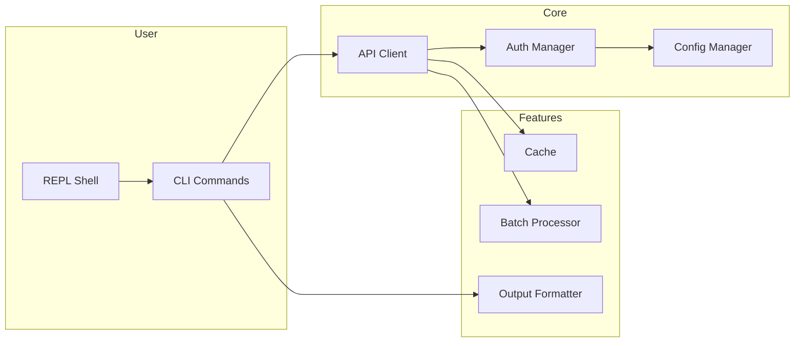
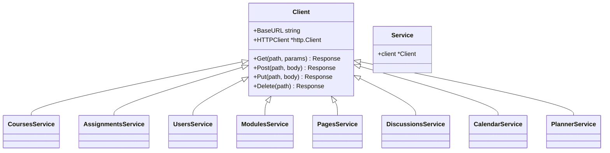
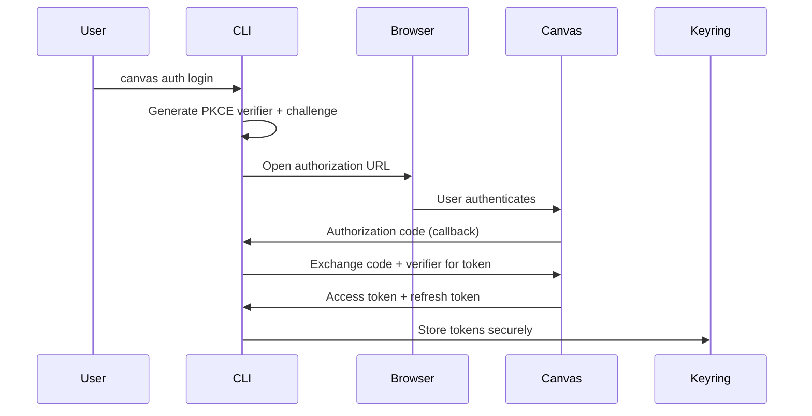
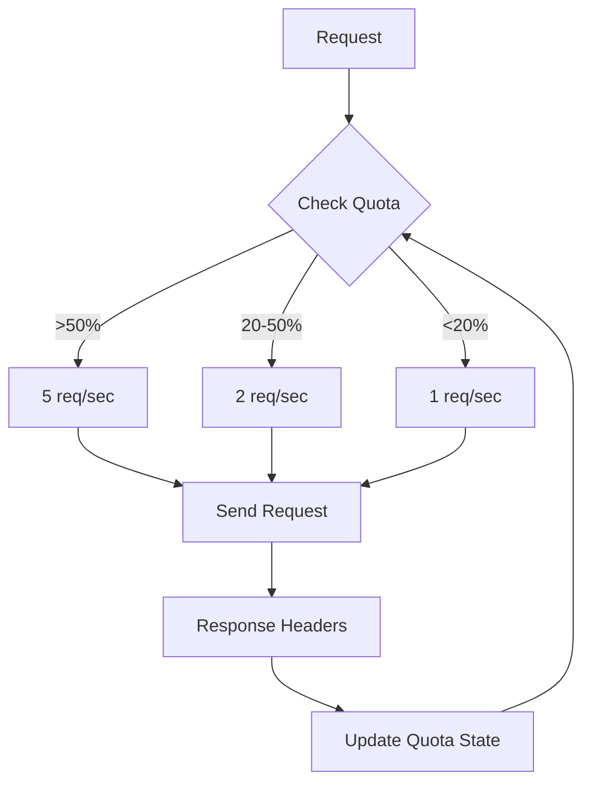
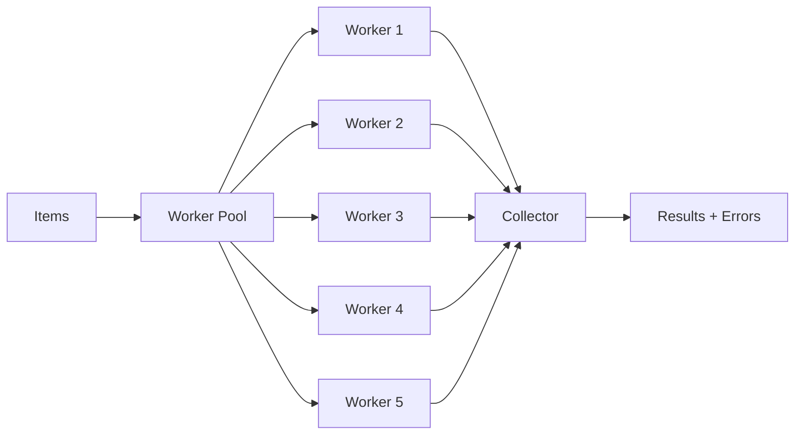

# Architecture

This document describes the internal architecture of Canvas CLI.

## Project Structure

```
canvas-cli/
├── cmd/canvas/           # Application entry point
├── commands/             # CLI command definitions (Cobra)
├── internal/
│   ├── api/             # Canvas API client and services
│   ├── auth/            # OAuth 2.0 + PKCE authentication
│   ├── config/          # Configuration management
│   ├── cache/           # Response caching
│   ├── batch/           # Concurrent batch operations
│   ├── repl/            # Interactive shell
│   └── output/          # Output formatters
├── pkg/                 # Public packages
├── docs/                # Documentation
└── test/                # Test fixtures
```

## Component Overview



## Core Components

### API Client

The API client (`internal/api/`) provides a type-safe interface to the Canvas REST API.



**Key features:**
- Automatic pagination handling
- Rate limit awareness
- Exponential backoff retry
- Request/response logging

### Authentication

OAuth 2.0 with PKCE (Proof Key for Code Exchange) for secure authentication.



**Token storage priority:**
1. System keyring (macOS Keychain, Windows Credential Manager, Linux Secret Service)
2. Encrypted file fallback (AES-256-GCM)

### Rate Limiting

Adaptive rate limiting respects Canvas API quotas.



### Caching

Smart caching with TTL-based invalidation:

| Resource | TTL |
|----------|-----|
| Courses | 15 minutes |
| Users | 5 minutes |
| Assignments | 10 minutes |
| Modules | 10 minutes |

### Batch Processing

Concurrent processing with configurable parallelism:



## Technology Stack

| Component | Technology |
|-----------|------------|
| Language | Go 1.21+ |
| CLI Framework | [Cobra](https://github.com/spf13/cobra) |
| Configuration | [Viper](https://github.com/spf13/viper) |
| OAuth | golang.org/x/oauth2 |
| Rate Limiting | golang.org/x/time/rate |
| Keyring | zalando/go-keyring |
| Logging | log/slog (stdlib) |

## Design Principles

1. **Security First** - All credentials encrypted, no hardcoded secrets
2. **Graceful Degradation** - Fallbacks for keyring, network, and API issues
3. **User Experience** - Progress indicators, helpful error messages
4. **Testability** - Interface-driven design, mock-friendly
5. **Performance** - Caching, batching, concurrent operations

## Error Handling

Custom error types with actionable suggestions:

```go
type CanvasError struct {
    StatusCode int
    Message    string
    Suggestion string
    DocURL     string
}
```

## Testing Strategy

- Unit tests for all services
- Integration tests with mock HTTP server
- 90% code coverage target
- Race condition detection enabled
